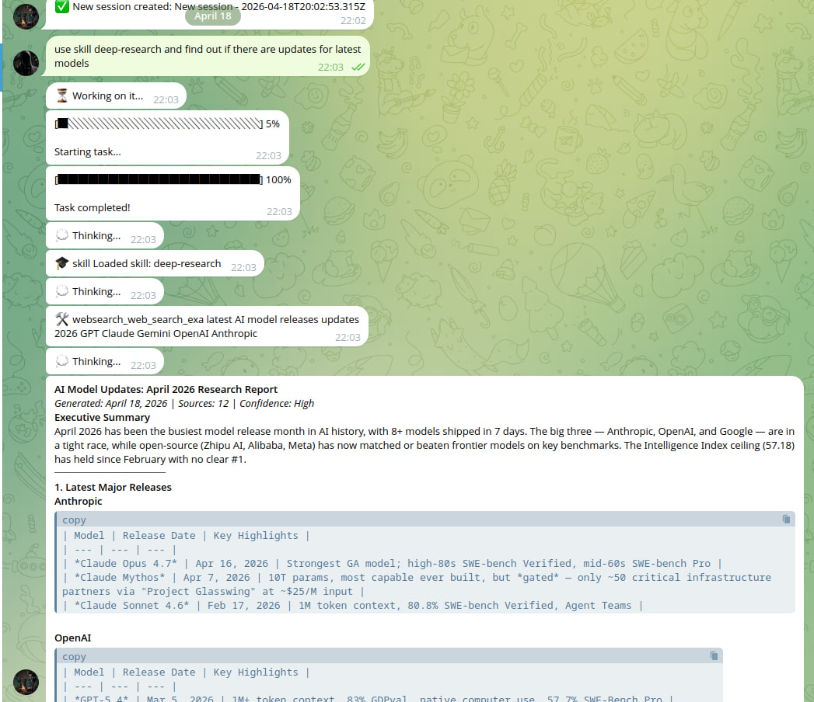
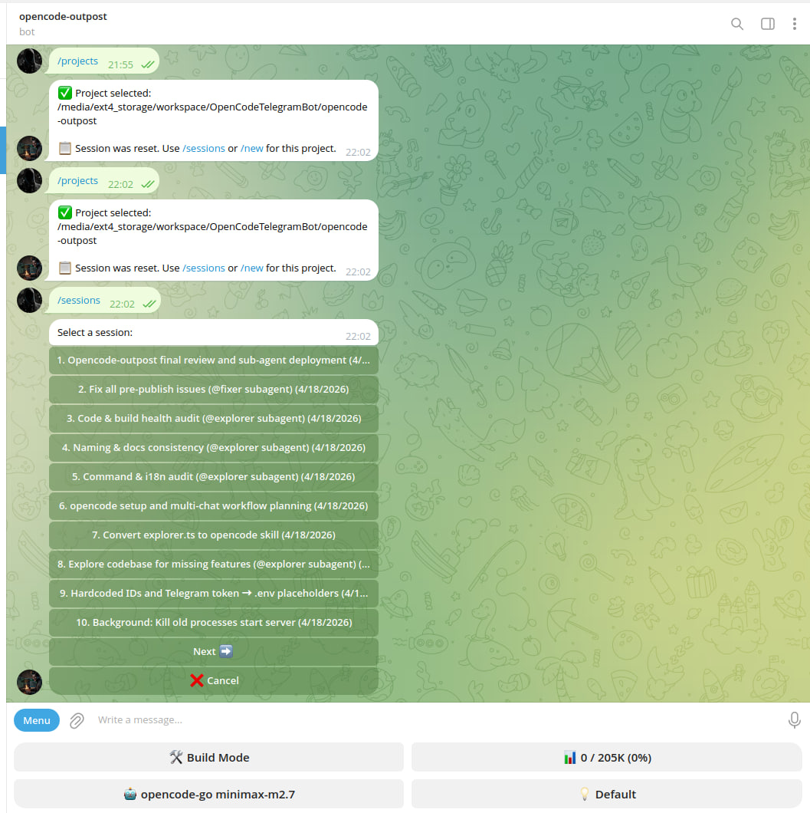
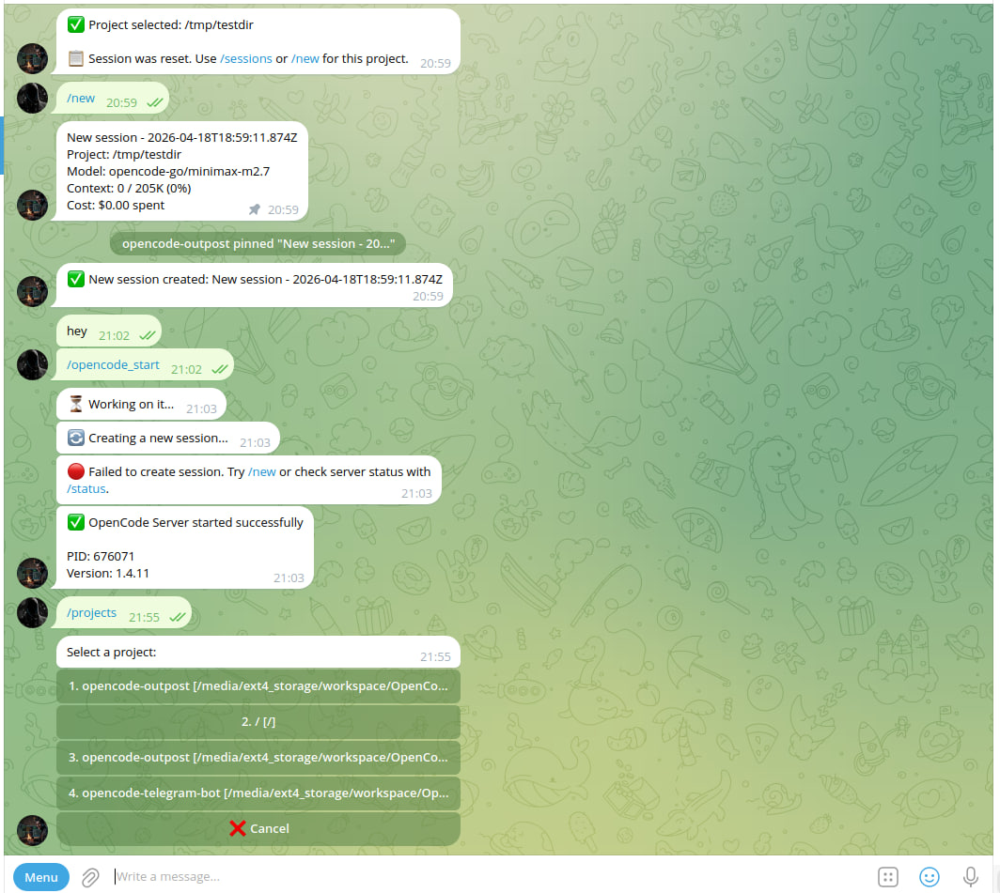

# OpenCode Outpost

> A Telegram bot client for [OpenCode](https://opencode.ai) — run and monitor coding tasks from your phone.

<p align="center">
  <a href="https://www.npmjs.com/package/@tbosancheros39/opencode-outpost">
    
  </a>
  <a href="https://github.com/tbosancheros39/opencode-outpost/actions/workflows/ci.yml">
    
  </a>
  <a href="https://github.com/tbosancheros39/opencode-outpost/blob/main/LICENSE.md">
    
  </a>
  <a href="https://nodejs.org/">
    
  </a>
  <a href="https://www.npmjs.com/package/@tbosancheros39/opencode-outpost">
    
  </a>
</p>

## Demo

<p align="center">
  
</p>

<p align="center">
  
  
  
</p>

## Table of Contents

- [Why Outpost?](#why-outpost)
- [Quick Start](#quick-start)
- [Features](#features)
- [Skills](#skills)
- [Commands](#commands)
- [Configuration](#configuration)
- [Deployment](docs/DEPLOYMENT.md)
- [Troubleshooting](#troubleshooting)
- [FAQ](#faq)
- [Roadmap](#roadmap)
- [Community](#community)
- [License](#license)

## Features

- Multi-user access control with role-based permissions
- BullMQ + Redis task queue for scheduled background tasks
- Bubblewrap execution sandboxing for shell commands
- 40 commands including /shell, /sandbox, /fe, /cost, /tts
- Streaming responses with live draft updates
- Voice transcription via Whisper-compatible APIs
- Text-to-speech replies
- Inline mode commands (@bot feynman: explain X)
- 7 locales (en, de, es, fr, ru, zh, bs)
- Proxy support (SOCKS5, HTTP/HTTPS)
- MarkdownV2 rendering with remark-gfm

## Skills

OpenCode loads skills from `~/.config/opencode/skills/`. A curated set of ready-to-use skills is included in [`assets/skills.zip`](assets/skills.zip).

> **Warning:** Loading all skills at once will consume significant context window space. Pick only the skills you need and copy them individually to your skills folder.

### Installing Skills

```bash
# Extract specific skills you want
unzip assets/skills.zip "skill-name/*" -d ~/.config/opencode/skills/

# Or extract all (not recommended — uses lots of context)
unzip assets/skills.zip -d ~/.config/opencode/skills/
```

## Roadmap

See [PRODUCT.md](./PRODUCT.md) for feature status and planned work.

## Commands

40 commands organized by function:

### Session & Project
| Command | Description |
| ------- | ----------- |
| `/new` | Start a new session |
| `/sessions` | List all cached sessions |
| `/projects` | List all projects |
| `/status` | Show current session status |
| `/abort` | Abort the current task |
| `/rename` | Rename the current session |
| `/messages` | Show session messages |
| `/snapshot` | Save a session snapshot |
| `/resume` | Resume from a snapshot |

### Task Execution
| Command | Description |
| ------- | ----------- |
| `/task` | Queue a background task |
| `/tasks` | List pending tasks (alias for /tasklist) |
| `/tasklist` | List pending tasks |
| `/compact` | Request prompt compaction |
| `/steer` | Steer the current task |
| `/digest` | Summarize recent session activity |

### Local Operations
| Command | Description |
| ------- | ----------- |
| `/shell` | Execute bash in sandbox |
| `/ls` | List directory contents |
| `/read` | Read file contents |
| `/fe` | File explorer |
| `/find` | Search files by name |
| `/logs` | Show process logs |
| `/health` | Show system health |
| `/journal` | Show journal telemetry |
| `/sandbox` | Show sandbox status |
| `/export` | Export session data |

### Git Operations
| Command | Description |
| ------- | ----------- |
| `/branch` | Show or switch git branch |
| `/commit` | Create a git commit |
| `/diff` | Show git diff |

### Browsing & Selection
| Command | Description |
| ------- | ----------- |
| `/skills` | Manage skills |
| `/mcps` | Manage MCP servers |
| `/models` | Switch LLM models |
| `/pin` | Pin files to session context |
| `/commands` | List available commands |

### Bot Control
| Command | Description |
| ------- | ----------- |
| `/start` | Start the bot |
| `/help` | Show help |
| `/opencode_start` | Start OpenCode server |
| `/opencode_stop` | Stop OpenCode server |
| `/cost` | Show token cost |
| `/tts` | Text-to-speech reply |

### Inline Commands (via @bot)
Type in any chat: `@botname <command>: <query>`

| Command | Description |
| ------- | ----------- |
| `summarise:` | Summarize text to bullet points |
| `eli5:` | Explain like I'm 5 |
| `deep-research:` | Deep research with sources |
| `steel-man:` | Strongest argument FOR position |
| `feynman:` | Feynman technique explanation |
| `devil's-advocate:` | Argue opposite position |

## Why Outpost?

| Feature | Description |
|---------|-------------|
| Multi-user access | Role-based (super/simple/restricted) |
| Task queue | BullMQ + Redis |
| Shell execution | Bubblewrap sandbox |
| Commands | 40 |
| Inline mode | Yes (6 commands) |
| Voice + TTS | Full STT + TTS |
| File explorer | `/fe` command |
| System monitoring | `/health`, `/journal` |
| Localization | 7 languages |

## Quick Start

### Prerequisites

- **Node.js 20+** — [download](https://nodejs.org/)
- **Redis** — `apt install redis` or `brew install redis`
- **OpenCode CLI** — `npm install -g @opencode-ai/cli` or from [opencode.ai](https://opencode.ai/)

### 1. Create a Telegram Bot

1. Message [@BotFather](https://t.me/BotFather) on Telegram
2. Send `/newbot` → choose name → choose username (must end in `bot`)
3. Copy the bot token (looks like: `123456789:ABCdef...`)
4. **Enable inline mode:** Send `/setinline` → select bot → enter placeholder text
5. Get your Telegram User ID: Message [@userinfobot](https://t.me/userinfobot)

### 2. Start OpenCode Server

```bash
opencode serve
```

### 3. Install & Run

**Fastest — via npx (no clone needed):**
```bash
npx @tbosancheros39/opencode-outpost
```
Interactive wizard guides you through config on first launch.

**Alternative — global install:**
```bash
npm install -g @tbosancheros39/opencode-outpost
opencode-outpost
```

**Alternative — from source (for development):**
```bash
git clone https://github.com/tbosancheros39/opencode-outpost.git
cd opencode-outpost
npm install
cp .env.example .env
# Edit .env with your token and user ID
npm run dev
```

**Alternative — Docker (1 command, no Node.js needed):**
```bash
git clone https://github.com/tbosancheros39/opencode-outpost.git
cd opencode-outpost
cp .env.example .env
# Edit .env with your token and user ID
docker compose up -d
```
See [READMEwindows.md](READMEwindows.md) for detailed Docker and Windows setup.

## Configuration

Edit `.env` file:

```bash
# Required
TELEGRAM_BOT_TOKEN=your_token_from_botfather
TELEGRAM_ALLOWED_USER_IDS=your_telegram_user_id
OPENCODE_MODEL_PROVIDER=opencode
OPENCODE_MODEL_ID=big-pickle

# Optional: Speech-to-Text (for voice messages)
STT_API_URL=https://api.openai.com/v1
STT_API_KEY=your_openai_key

# Optional: Text-to-Speech
TTS_ENABLED=true
TTS_API_URL=https://api.openai.com/v1
TTS_API_KEY=your_openai_key
```

**Group Chat Setup:**
1. Add bot to your group
2. Get group chat ID: Send `/chatid` in group (or check message details)
3. Add to `.env`: `TELEGRAM_ALLOWED_CHAT_IDS=-1001234567890`
4. **Note:** All allowed users can use bot in group. Responses visible to all members.

### Multi-Chat Setup

By default, the bot operates in **single-chat mode** — one private DM per user. To run multiple concurrent chats (e.g., separate sessions for different projects), you must use **Telegram groups**.

**How it works:**
- Each chat (DM or group) gets its own independent session with separate context and history
- `MAX_CONCURRENT_CHATS` (default: 3) limits active chats per user
- Inactive chats auto-close after 5 minutes

**Step-by-step:**

1. **Disable Privacy Mode** (required for groups):
   - Message [@BotFather](https://t.me/BotFather)
   - Send `/setprivacy`
   - Select your bot → choose **Disable**
   - This allows the bot to read all messages in groups (not just commands)

2. **Create groups and add the bot:**
   - Create **Group A** in Telegram (e.g., "Project Alpha")
   - Add your bot as a member
   - Promote bot to **Admin** (required for message editing and file access)
   - Repeat for **Group B** (e.g., "Project Beta")

3. **Get group chat IDs:**
   - Send `/status` in each group — the bot will show the chat ID
   - Or add [@userinfobot](https://t.me/userinfobot) to the group temporarily

4. **Update `.env`:**
   ```env
   # Allowed chat IDs (comma-separated, groups start with -100)
   TELEGRAM_ALLOWED_CHAT_IDS=-1001234567890,-1009876543210

   # Max concurrent active chats per user (default: 3)
   MAX_CONCURRENT_CHATS=3
   ```

5. **Restart the bot** for changes to take effect.

**Example setup for 3 concurrent chats:**

| Chat | Type | Session |
|------|------|---------|
| Private DM | Direct message to bot | Personal tasks |
| Group A | Telegram group with bot | Project Alpha |
| Group B | Telegram group with bot | Project Beta |

Each chat maintains its own session. Switch between them freely — the bot tracks context independently per chat.

**API Providers for STT/TTS:**
- OpenAI: https://platform.openai.com/api-keys
- Groq: https://console.groq.com/keys
- Together AI: https://api.together.xyz/settings/api-keys

See [.env.example](.env.example) for all 41 supported environment variables.

## Troubleshooting

**Bot doesn't respond to messages**
- Verify `TELEGRAM_ALLOWED_USER_IDS` matches your actual Telegram user ID (check with [@userinfobot](https://t.me/userinfobot))
- Check bot token is correct in `.env`
- Ensure bot is running: check `journalctl` or console output

**"OpenCode server is not available"**
- Ensure OpenCode server is running: `opencode serve` or use `/opencode_start` in Telegram
- Verify `OPENCODE_API_URL` in `.env` (default: `http://localhost:4097`)
- Check if port 4097 is available

**Redis connection errors**
- Start Redis: `redis-server` or `systemctl start redis`
- Verify `REDIS_URL` in `.env` (default: `redis://localhost:6379`)
- Test connection: `redis-cli ping` should return `PONG`

**Permission denied on Linux**
- Ensure config directory is writable: `~/.config/opencode-outpost/`
- Check systemd service user has correct permissions
- Verify `node` binary path in systemd unit matches actual location

**No models in model picker**
- Add models to OpenCode favorites: open OpenCode TUI, press **Cmd+F/Ctrl+F** on desired models
- Verify `OPENCODE_MODEL_PROVIDER` and `OPENCODE_MODEL_ID` point to available models

**Voice transcription not working**
- Verify `STT_API_URL` and `STT_API_KEY` are set in `.env`
- Check STT provider has credits/billing enabled
- Test API key manually with curl

**TTS (spoken replies) not working**
- Enable with `/tts` command in Telegram
- Verify `TTS_API_URL` and `TTS_API_KEY` are configured
- Check bot has permission to send voice messages

## FAQ


**Do I need Redis?**
Yes, Redis is required for BullMQ task queues and scheduled background tasks. Install with `apt install redis` or `brew install redis`.

**Can I use this in a group?**
Yes. See [Multi-Chat Setup](#multi-chat-setup) for configuration.

**Does this work without OpenCode running?**
No. The bot requires a local OpenCode server. Start it with `opencode serve` or `/opencode_start`.

**What's the roadmap?**
See [PRODUCT.md](./PRODUCT.md) for feature status and planned work.

## Deployment

### Start services

```bash
# Terminal 1: Start Redis
redis-server
# Or: systemctl start redis

# Terminal 2: Start OpenCode
opencode serve

# Terminal 3: Run the bot
npm run build
npm run dev
```

### Systemd service example

```ini
[Unit]
Description=OpenCode Telegram Bot
After=network.target redis.service

[Service]
Type=simple
User=your-user
WorkingDirectory=/path/to/opencode-outpost
ExecStart=/usr/bin/node dist/cli.js
Restart=on-failure
RestartSec=5
Environment=NODE_ENV=production

[Install]
WantedBy=multi-user.target
```

## Security

See [SECURITY.md](SECURITY.md) for access control, sandboxing, and environment sanitization details.

## Contributing

See [CONTRIBUTING.md](CONTRIBUTING.md) for development setup, testing, and commit conventions.

## Community

Have questions, feedback, or ideas?

- 💬 [GitHub Discussions](https://github.com/tbosancheros39/opencode-outpost/discussions) — Ask questions, share experiences
- 🐛 [GitHub Issues](https://github.com/tbosancheros39/opencode-outpost/issues) — Bug reports and feature requests
- 🍴 **Contributions welcome!**

## License

MIT License
